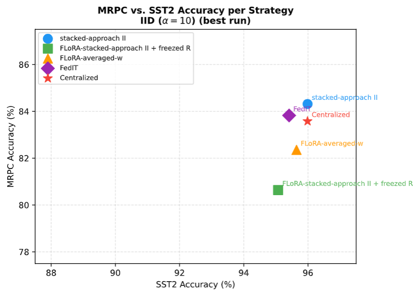
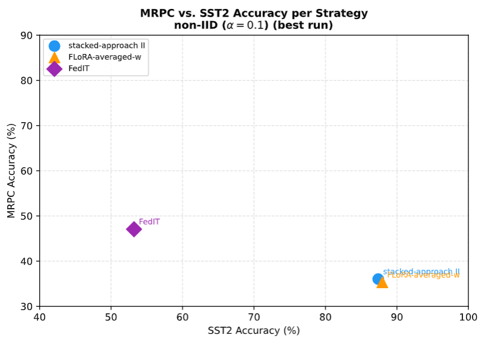

<h1 align="center"> MTL-FLoRA: Federated Low-Rank Adaptation<br/>for Multi-Task Learning </h1>

<h5 align="center"><em>Christian Jesinghaus, Joshua Heitbreder, Julia Köpp</em>
</h5>
</br>

## Introduction
We present **MTL-FLoRA**, a federated extension of **MTL-LoRA** that enables efficient multi-task fine-tuning of large Transformer models in a distributed setting. Building on FLoRA’s observation that naïve FedAvg over LoRA factors injects noise into aggregation, MTL-FLoRA lifts the adapter parameterization \(A, \Lambda_t, B_i, w_i^t\) into a federated setting and proposes two server-side aggregation strategies:

- **Approach I — Matrix-weighted stacking:** Aligns task-specific adapters across clients and aggregates parameters using full *matrix-valued* weights to share knowledge between clients. This generalizes block-diagonal FLoRA aggregation to the multi-task setting and ensures the global update matches the intended, data-proportional FedAvg update.

- **Approach II — Scalar-weighted stacking:** Stacks client parameters into disjoint rank blocks and performs block-wise normalization with *scalar* mixture weights. This strategy is more resource-efficient and, according to our experiments, achieves the best results on TinyLlama under both IID and non-IID splits.

The main branch of this repository implements **Approach II** on the [TinyLlama-1.1B-Chat-v1.0](https://huggingface.co/johnsnowlabs/tinyllama-1.1b-Chat-v1.0) causal language model. All paper experiments for this approach (excluding the `freeze-R` ablation) are included. Freeze-R and RoBERTa results live on separate branches and can be reviewed manually. Freeze-R can be found on the "freezeR" branch.

The figure below shows the architecture of approach I. For additional information about the second approach review the paper, which can be found in the repository. 

<div style="align: center;">
  
</div>

## Usage and Reproducing

### Quick Start
The following steps set up the environment and reproduce the paper’s TinyLlama experiments.

1) **Install dependencies**

The project requires **PyTorch**, **HuggingFace Transformers**, **bitsandbytes**, and **DeepSpeed** for parameter-efficient fine-tuning.

Using the included `requirements.txt`, you can set up a Python environment (**Python ≥ 3.9**):
```bash
python -m venv .venv
source .venv/bin/activate
pip install --upgrade pip
pip install -r requirements.txt
```
### Flash-Attention and 4-bit quantization

For 4-bit quantization and fast attention, **flash-attention** must be compiled for your CUDA/GPU setup.

### Prepare HuggingFace access

The scripts download models and datasets from the HuggingFace Hub. Set your token via `HUGGINGFACE_HUB_TOKEN=<token>` or create a `.hf_token` file in your home directory (see the HuggingFace documentation).

### Run TinyLlama Experiments (Approach II)

Training and evaluation are controlled via shell scripts in the repo. For TinyLlama, the main script runs federated training with block-wise stacking (Approach II):
# Training on MRPC and SST-2 with TinyLlama and Approach II
```bash
    train_tinyllama_mtl_mlora.sh \
    --output_dir outputs/ \
    --num_fl_rounds 3 \        # Number of federated rounds
    --num_epochs 3 \           # Local epochs per round
    --num_B 3 \                # Number of B matrices (rank blocks)
    --lora_r 8 \               # Initial LoRA rank per client
    --lora_alpha 16 \          # LoRA alpha parameter
    --temperature 0.1 \        # Temperature for mixture weights
    --fp16                    # Enable mixed precision
```
The script automatically starts **Apptainer** containers and runs training across clients. Logs and checkpoints are stored in `outputs/`. Additional helper scripts (evaluation, hyperparameter tests) are also avaiable.

### Evaluation

To evaluate a trained model (Approach II):
```bash
    eval_tinyllama_mtl_mlora.sh \
    outputs/
```


### Hyperparameters

The paper studies different parameter settings. The defaults above represent the best TinyLlama configuration: **3 federated rounds**, **3 local epochs**, **3 B matrices**, and **initial rank 8 per client**.

### Main Results (TinyLlama, Approach II)

The table below summarizes GLUE validation results (MRPC and SST-2) for Approach II and several baselines. Values are averaged across tasks and use the hyperparameters above. Under IID splits, differences are small, but Approach II slightly exceeds the centralized baseline. Under non-IID splits, Approach II shows a clear advantage: FedIT is about **11.6 percentage points** worse on average, and Approach II is the only method outperforming the centralized baseline. The Freeze-R variant is only slightly worse and scales linearly, making it attractive for resource-constrained environments.

| Method & Split | MRPC Acc. | MRPC F1 | SST-2 Acc. | Average |
|---|---:|---:|---:|---:|
| Centralized baseline | 83.6 | 88.1 | 96.0 | 89.8 |
| Approach II (IID) | 84.3 | 89.0 | 96.0 | 90.1 |
| Approach II + Freeze-R (IID) | 80.6 | 86.9 | 95.1 | 87.9 |
| Approach I — without stacked `w` (IID) | 82.4 | 87.8 | 95.6 | 89.0 |
| FedIT (IID) | 83.8 | 88.6 | 95.4 | 89.6 |
| Approach II (non-IID) | 36.0 | 15.5 | 87.4 | 61.7 |
| Approach I — without stacked `w` (non-IID) | 35.3 | 13.7 | 88.0 | 61.6 |
| FedIT (non-IID) | 47.1 | 45.2 | 53.2 | 50.1 |

<!-- ===== Figures (placed at the bottom of the README) ===== -->

<div align="center">
  
    

</div>
(see MTL-FLoRA Paper in the repository for further information)
<!-- ===== Acknowledgements (mentioning original MTL-LoRA) ===== -->

## Acknowledgements

This repository builds on **MTL-LoRA** and **FLoRA** and extends these ideas to a federated setting. We thank the maintainers and contributors of the original projects, as well as the broader open-source community, for their work and support.

